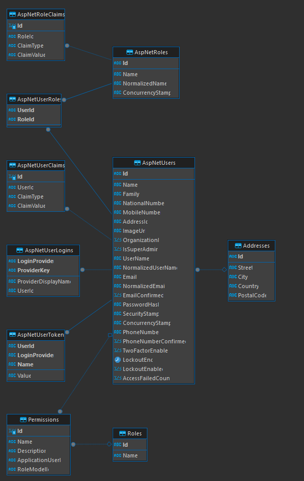

# IdentityService

IdentityService is a microservice that handles user authentication and authorization using JWT (JSON Web Tokens). It leverages ASP.NET Core Identity and SQL Server for user management, including password hashing and validation.

## Features

- User authentication using JWT tokens.
- Secure password hashing with ASP.NET Core Identity.
- Async methods for efficient user management and authentication.
- SQL Server integration for user data storage.
- Initial user seeding for testing (`mehran` and `admin` users).
- RESTful API for user login.

## Prerequisites

- [.NET 8 SDK](https://dotnet.microsoft.com/download)
- [SQL Server](https://www.microsoft.com/en-us/sql-server/sql-server-downloads)
- Entity Framework Core (included in the project)

## Getting Started

### 1. Clone the repository

```bash
git clone <repository-url>
cd backend/IdentityService
```

### 2. Update the Configuration

Update the connection string in `appsettings.json` to match your SQL Server configuration:

```
{
  "ConnectionStrings": {
    "DefaultConnection": "Server=your_server;Database=IdentityServiceDb;User Id=your_user;Password=your_password;"
  },
  "Jwt": {
    "Key": "MehranSecureKeyThatIsAtLeast32BytesLongIII",
    "Issuer": "IdentityService",
    "Audience": "Kasbotech",
    "Subject": "IdentityKasbo"
  }
}

```

### 3. Run Database Migrations

Run the following commands to create the database and apply the migrations:

```
dotnet ef migrations add InitialCreate
dotnet ef database update

```

### 4. Run the Application:

```
dotnet run

```

The service will now be running at `https://localhost:7069/` (or another port, depending on your configuration).

### 5. Seed Initial Users

On startup, the application will seed two initial users:

- Username: **mehran** , Password: **password**
- Username: **admin** , Password: **admin**

These users are seeded once in the database and can be used to test the login functionality.

## API Endpoints

### POST `/api/auth/login`

Authenticate a user and receive a JWT token.

**Request** :

```
{
  "username": "mehran",
  "password": "password"
}

```

**Response (Success)** :

```
{
  "username": "mehran",
  "email": "mehran@example.com",
  "token": "<JWT_TOKEN>"
}

```

**Response (Failure)** :

```
{
  "error": "Invalid credentials"
}

```

---

## Identity ER Diagram:


